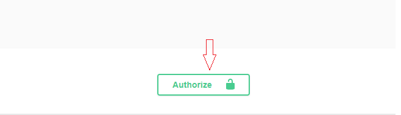
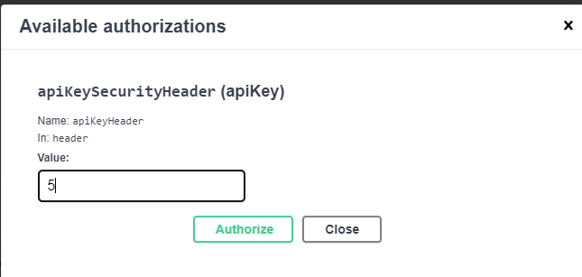

# Ninja RMM Services API

### Introduction
A proof of concept for a Remote Monitoring and Management (RMM) company provides services that monitor and manage devices

### Prerequisites to run the application
To run the application JDK 11 and Maven must be installed 
* For more instructions on JDK visit [jdk11](https://docs.aws.amazon.com/corretto/latest/corretto-11-ug/downloads-list.html)
* For more instructions on Maven visit [maven](https://maven.apache.org/install.html)

### Running the application
To run the application 
* Build the application with **mvn clean install**
* then Execute **mvn spring-boot:run** at the root of the module folder.
* application will run on port 8090 by default to change port, run command with parameters.  
  Ex. mvn **spring-boot:run -Dspring-boot.run.arguments=--server.port=8088**
* go to [http://localhost:8090/swagger-ui/index.html?configUrl=/v3/api-docs/swagger-config](http://localhost:8090/swagger-ui/index.html?configUrl=/v3/api-docs/swagger-config) to access   application swagger page
* To view and query DB go to [http://localhost:8090/h2-console/login.jsp](http://localhost:8090/h2-console/login.jsp) (system uses h2 in memory database, this is just to be used in local development environments ) using properties
   * Driver Class: org.h2.Driver
   * JDBC URL: jdbc:h2:mem:testdb
   * User Name: sa
   * Password:           
	leave password empty

Application uses liquabase for database management you can look at the liquibase script for more details [liquibase-changeLog.xml](./src/main/resources/db/changelog/liquibase-changeLog.xml) 
### Using the application
 to functionally test the application, run the application and then visit [swagger-ui](http://localhost:8090/swagger-ui/index.html?configUrl=/v3/api-docs/swagger-config).
 Swagger-ui will allow you test and will also provide documentation application
 
 Application uses a very simple authorization scheme as part of the POC
 
 with default setup Rest Api calls require **apiKeyHeader** header for authorization.  
 Role is bound to HTTP method so READ_USER role will have access to execute GET requests to all Apis.  
 use apiKeyHeader value of 5 which has admin access.  
 The following values provide different level access.  

| Header Key |Header Value |Role | Access|
|----|---|---|---|
| apiKeyHeader| 0 | NONE_USER |n/a|
| apiKeyHeader| 1 | READ_USER |READ|
| apiKeyHeader| 2 | CREATE_USER |CREATE|
| apiKeyHeader| 3 | UPDATE_USER |UPDATE|
| apiKeyHeader| 4 | DELETE_USER |DELETE|
| apiKeyHeader| 5 | ADMIN_USER |READ,CREATE,UPDATE,DELETE|

 You can use swagger-ui Authorize button and provide the value of the header to test the APIs  
 
 
 
 
   
 
 
   
 
 
### Testing the application
Integration testing was implemented using cucumber spring you can look at feature files

* [devices](./src/main/resources/features/device_all.feature)
* [services](./src/main/resources/features/service_all.feature)
* [cost](./src/main/resources/features/cost_all.feature)

to test the application run **mvn test**  
a cucumber html report will be generated at **target/cucumber-reports**  

Sample cucumber report   
* [report](./docs/cucumber-reports.html)
